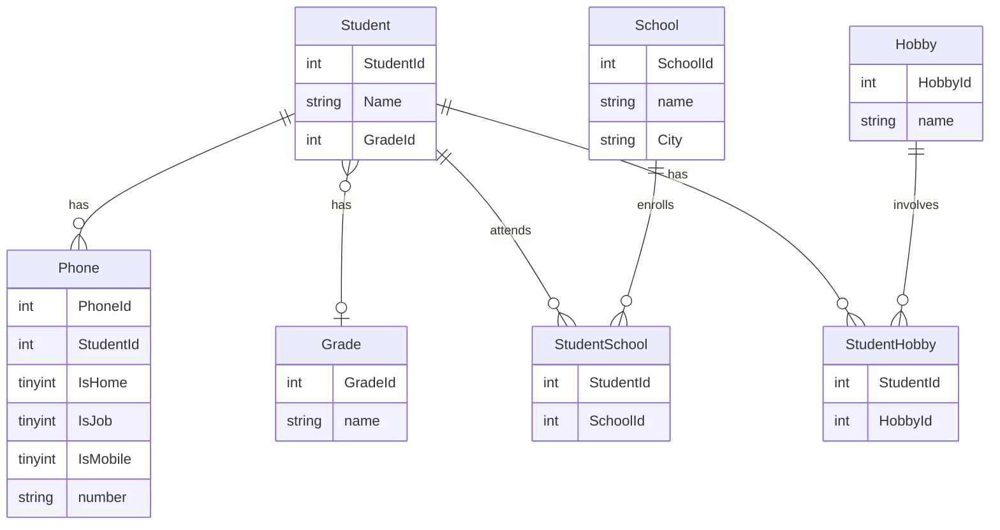

## Beskrivning

Detta är min redovisning för kursen db2022 på IT-Högskolan. Kunskaperna som redovisas är normalisering av databas, SQL samt Java mot en relationsdatabas.

[Mermaid](https://mermaid-js.github.io/mermaid/#/entityRelationshipDiagram) är ett verktyg för att rita diagram i Markdown. Istället för exemplevis Lucidchart, valde vi Mermaid, för att få grafen kodnära.

## Entity Relationship Diagram

## Normalisera databas

docker exec -i iths-mysql mysql -uiths -piths < normalization.sql
